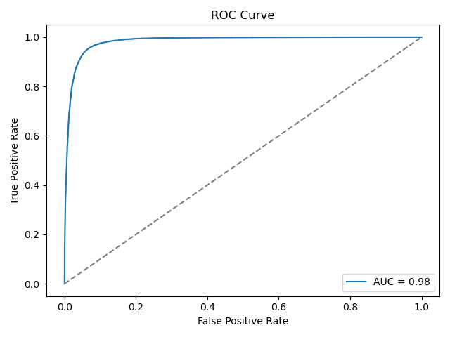
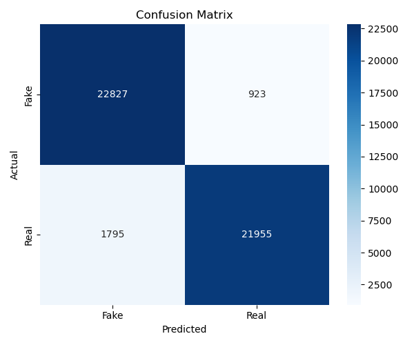

# AI vs Real Image Detection

This project provides a modular, feature-based pipeline to distinguish AI-generated images from real photographs using classical machine learning techniques. It supports flexible feature extraction, training multiple models (including ensembles), streaming support for large datasets (e.g. DRAGON), and detailed logging for analysis and reproducibility.

---

## Project Structure

```
.
├── data/                     # Real and fake image datasets (not pushed to GitHub)
│   ├── real/                # Folder containing real images
│   └── fake/                # Folder containing fake images + metadata
│       └── fake_metadata.csv  # Metadata with model and class info
│
├── src/                      # Core source code
│   ├── cache/               # Cached features (ignored via .gitignore)
│   ├── download_data.py     # Script to download and prepare datasets
│   ├── extract_features.py  # Dataset-wide feature extraction
│   ├── train_model.py       # Train and save models
│   ├── evaluate_model.py    # Utilities for model evaluation
│   ├── stream_dragon_features.py  # Feature extraction via streaming from DRAGON
│   ├── dataset_stats.py     # Histogram and distribution plots of dataset properties
│   └── utils/               # Utility functions
│       ├── feature_registry.py  # Registered feature functions
│       ├── io.py               # Feature caching helpers
│       └── preprocessing.py    # Image preprocessing helpers
│
├── docs/                     # Documentation related to the study
├── notebooks/                # Jupyter notebooks for analysis and experiments
├── outputs/                  # Generated experiment outputs (plots, models, logs)
├── run_experiments.py        # Command-line pipeline runner
├── environment.yml           # Conda environment definition
└── README.md                 # This file
```


---

## Environment Setup

To set up the project environment:

```bash
conda env create -f environment.yml
conda activate ai_image_detection
```
This file installs required packages via both conda and pip.

---

## Dataset Setup
This project uses a mix of real and AI-generated images:

- Real images are sourced from the ImageNet 2012 validation set.

- Fake images are sourced from the DRAGON dataset via Hugging Face.

To download and prepare these datasets automatically:

```bash
python src/download_data.py
```
### Configuration
To control which data is downloaded and how it's stored, modify the variables at the top of src/download_data.py:

```python
MAX_IMAGES = 25000                  # Max images per class
DRAGON_SUBSET = "Regular"          # DRAGON subset to use (e.g., "Regular", "Difficult")
DRAGON_SPLIT = "train"             # Dataset split ("train", "test")
TARGET_DIR = "./data"              # Root directory to store datasets
IMAGENET_URL = "..."               # URL for ImageNet tar (default provided)
```
The script performs the following:
- Downloads the ImageNet 2012 validation set (ILSVRC2012_img_val.tar) and extracts the first MAX_IMAGES into data/real/.

- Fetches MAX_IMAGES fake samples from the DRAGON dataset and saves: JPEG images to data/fake/

- Metadata (model name + ImageNet class) to data/fake/fake_metadata.csv


### For Limited Storage Environments
If you're constrained by disk space (e.g., working with the Large or ExtraLarge subsets of DRAGON), use the streaming-based feature extraction script instead. This allows you to extract features on-the-fly without storing full images or using the cache.

```bash
python src/stream_dragon_features.py \
    --subset large \
    --split test \
    --features fft_alpha fft_vert fractal_dimension \
    --output_dir dragon_features \
    --target_size 512 \
    --batch_size 32
```
This will:

- Stream the specified subset and split of the DRAGON dataset using streaming=True

- Extract the selected features from each image batch

- Resize each image to --target_size (e.g., 512×512)

- Save the extracted features along with metadata (generative model, ImageNet class ID) to a CSV inside --output_dir

- Avoid full image storage and skip any caching mechanism

You can also optionally limit the number of streamed images by using --limit.

---

## Running Experiments

Use `run_experiments.py` to extract features, train a classifier, and evaluate performance on real vs. generated images.

### Basic Example

```bash
python run_experiments.py \
    --real_dir data/real \
    --fake_dir data/fake \
    --features fft_alpha corner_energy fft_horz fft_vert \
    --model rf \
    --target_size 512 \
    --output_dir outputs \
    --cache_dir src/cache \
    --total_images 10000 \
    --test_size 0.3
```

### Key Arguments

| Flag              | Description                                                                 |
|-------------------|-----------------------------------------------------------------------------|
| `--real_dir`      | Path to real image directory (default: `data/real`)                         |
| `--fake_dir`      | Path to fake image directory (default: `data/fake`)                         |
| `--features`      | List of feature names to extract (space-separated)                          |
| `--model`         | Model to train (`logistic`, `svm`, `rf`, `mlp`, `ensemble`, `stacked`)      |
| `--target_size`   | Resize images to this size before feature extraction (default: `256`)       |
| `--cache_dir`     | Folder to cache computed features (default: `src/cache`)                    |
| `--output_dir`    | Directory to store model outputs and logs (default: `outputs/`)             |
| `--total_images`  | Max number of images to use from each class (optional)                      |
| `--test_size`     | Proportion of data to use for testing (default: `0.2`)                      |
| `--no_scaling`    | If set, disables feature scaling before training                            |
| `--gen_models`    | (Optional) List of generative model names to filter fake images             |
| `--metadata_csv`  | Path to fake image metadata CSV (default: `data/fake/fake_metadata.csv`)    |
### Using a Subset of Generative Models

You can selectively train and evaluate models on a specific subset of diffusion models. This is useful for analyzing generalization, robustness, or focusing on specific generation styles.

To do this, use the `--selected_generative_models` flag followed by one or more model names from the list below:

**Available Generative Models:**

`Flash_PixArt`, `Flash_SD`, `Flash_SD3`, `Flash_SDXL`, `Flux_1`, `Hyper_SD`, `IF`, `JuggernautXL`, `Kandinsky`,  
`Kolors`, `LCM_SDXL`, `LCM_SSD_1B`, `Lumina`, `Mobius`, `PixArt_Alpha`, `PixArt_Sigma`, `Realistic_Stock_Photo`,  
`SD_1.5`, `SD_2.1`, `SD_3`, `SD_Cascade`, `SDXL`, `SDXL_Lightning`, `SDXL_Turbo`, `SSD_1B`

---

**Example: Run an experiment using only images generated by `SD_2.1`, `SDXL_Lightning`, and `PixArt_Alpha`:**

```bash
python run_experiments.py \
    --real_dir data/real \
    --fake_dir data/fake \
    --features fractal_dimension fft_alpha fft_vert \
    --model ensemble \
    --selected_generative_models SD_2.1 SDXL_Lightning PixArt_Alpha \
    --total_images 5000 \
    --test_size 0.3
``` 
---

## Results and Logging

After running an experiment, all results are saved inside the `outputs/` directory under a timestamped subdirectory. Each experiment logs the following:

- **ROC Curve**  
  `outputs/RESULT_DIR/results/roc_curve.png`

- **Confusion Matrix**  
  `outputs/RESULT_DIR/results/confusion_matrix.png`

- **Classification Report (all runs)**  
  `outputs/run_log.csv`

- **Experiment Configuration**  
  `outputs/RESULT_DIR/models/features_used.json`

- **Trained Model and Scaler**  
  `outputs/RESULT_DIR/models/*.pkl`

- **Train/Test Split Information**  
  `outputs/RESULT_DIR/models/split_info.csv`


## Results

The results below were obtained using the **ensemble classifier** trained on **5 selected features** from the **Regular subset** of DRAGON.  
We used **25,000 real** ImageNet validation images and **25,000 generated** images, with a **5% training / 95% testing split**.

<p align="center">
  
  
</p>

More results and their details are available in the /outputs directory. 

## Supported Models

| Model     | Description                                 |
|-----------|---------------------------------------------|
| `logistic`| Logistic Regression                         |
| `svm`     | Support Vector Machine (with probabilities) |
| `rf`      | Random Forest                               |
| `mlp`     | Multi-layer Perceptron (fully connected)    |
| `ensemble`| Soft-voting ensemble (RF + SVM + LR)        |
| `stacked` | Stacked generalization (meta-classifier)    |

Use --model to choose.

## Supported Features
You can mix and match features like:

- `fft_alpha`: FFT power spectrum decay - estimates how quickly frequency components decay, capturing global image structure.
- `fft_horz`, `fft_vert`: Directional FFT energy - measures horizontal and vertical frequency strength to capture structural alignment.
- `spectral_corner_energy`: Harris corner strength - captures proportion of energy concentrated in the corners of the frequency spectrum.
- `circular_power_ratio`: Radial vs tangential frequency energy - measures isotropy of frequency content.
- `fractal_dimension`: Image complexity - quantifies texture irregularity and self-similarity using a box-counting approximation.
- `dct_entropy`: Entropy of DCT coefficients - reflects information content and compression artifacts in discrete cosine transform space.
- `phase_coherence`: Phase consistency of FFT components - high coherence implies structured, natural image-like patterns.
- `principal_directional_energy`: Energy aligned with dominant gradient directions - captures geometric regularity or symmetry.
- `noise_residual_features`: Statistical features from denoised–original residual - captures noise patterns typical of synthetic generation artifacts.
